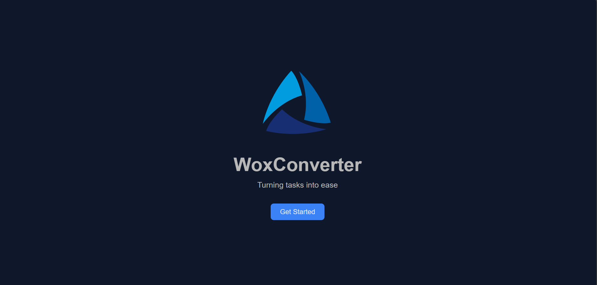
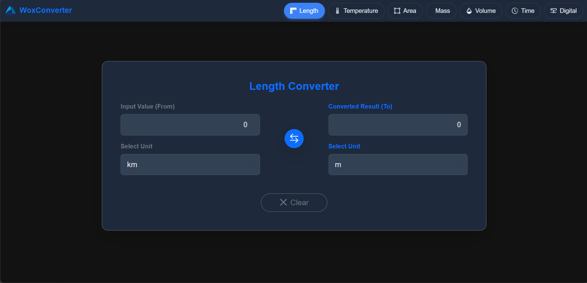

# WoxConverter 🔄

Preview : https://dimalka3005.github.io/WoxConverter/

**Turning tasks into ease.**  
A modern, responsive **unit converter web application** that supports multiple conversion types including Length, Temperature, Area, Mass, Volume, Time, and Digital units.  

Built with **HTML, CSS, JavaScript, and Bootstrap**.

---

## ✨ Features
- 📱 **Responsive Design** – Works on mobile, tablet, and desktop  
- 🎨 **Animated Start Screen** – Smooth entry animation with custom styling  
- 🔄 **7 Converter Categories** – Length, Temperature, Area, Mass, Volume, Time, Digital  
- 🌓 **Dark UI Theme** – Clean Bootstrap dark mode styling  
- ⚡ **Instant Conversion** – Updates results as you type  
- 🔘 **Unit Swap Button** – Quickly flip between input and output units  

---

## 📸 Screenshots

### Start Screen


### Converter Interface


---

### 1️⃣ Clone Repository
```bash
git clone https://github.com/Dimalka3005/woxconverter.git
